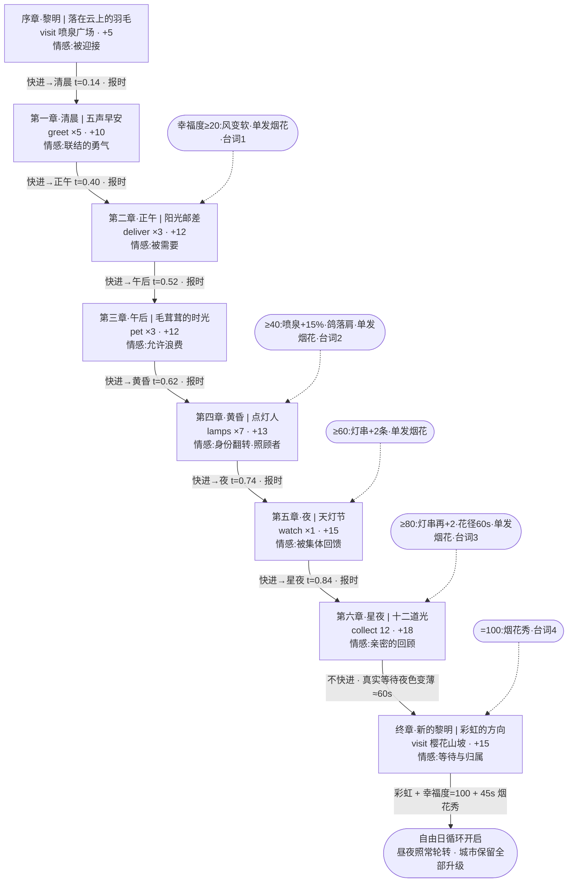

# 《Chole 之城》时间 × 游戏逻辑 大设计文档 TIMELINE.md

> 版本:v1.0 · 主设计师综合稿(叙事 / 时间系统 / 沉浸美学 三线合并)
> 唯一设计目的:**让玩家感到幸福。** 一切规格、参数、验收条目都为这一句服务。
> 本文档为实现基准:凡与旧实现冲突处,以本文档为准;所有跨设计矛盾已修正并记录于第 8 节。

---

## 1. 设计哲学:幸福感的来源拆解

治愈系不是"什么都没有"(没有敌人、没有失败),而是"每一样东西都在温柔地回应你"。我们把"幸福感"拆成八个可实现、可验收的来源,每一条都必须落到具体机制上,不允许停留在口号:

| # | 幸福来源 | 心理机制 | 落地机制(本次升级) |
|---|---------|---------|-------------------|
| 1 | **被看见、被记得** | 存在被确认 | 序章 Chole 记下玩家抵达的钟楼时刻;天灯上写着玩家的名字;照片落款"第 N 日" |
| 2 | **被需要** | 利他产生价值感 | 送信(deliver)、点灯(lamps)——玩家是城市运转的一环,不是观光客 |
| 3 | **被亲近** | 世界主动靠近你 | 萤火虫被玩家吸引而非逃开;柴犬翻肚皮;幸福度 40 后鸽子落肩;居民冒爱心 |
| 4 | **留下痕迹** | 我让世界变好了 | 脚印开花;幸福度驱动灯串增挂、花开过栅栏——抽象数值必须可见化 |
| 5 | **无压力的小确幸** | 稀有但零成本的惊喜 | 星夜流星(40–70 秒一颗)、幸福度里程碑单发烟花、窗户偶尔熄灭又亮 |
| 6 | **仪式感与刻度** | 时间被赋予意义 | 钟楼四音报时 + 鸽群绕塔;黄昏灯串涟漪点灯;天灯节三波升空 |
| 7 | **允许停下来** | 无所事事被正当化 | 长椅小憩(时流 ×2,坐着看完一场日落);拍照模式(时流 0.1×,收藏幸福) |
| 8 | **等待后的圆满** | 延迟满足的叙事闭环 | 终章明确"不快进",玩家用约一分钟真实时间看夜色变薄,等来彩虹 |

三条铁律(所有实现细节的否决性约束):

1. **温柔的物理**:任何生物不因玩家而逃散;任何音效总增益封顶(烟花 ≤0.35,环境 ≤0.25),绝不惊吓;烟花禁纯白纯红强闪,亮度封顶。
2. **数值必须长出形状**:幸福度每一档阈值都对应一处肉眼可见的城市变化,玩家可以不看数字、只看城市就知道自己做了多少好事。
3. **手机降级不降爱**:所有发光体自带 canvas 辉光 Sprite 作为 Bloom 的天然降级;粒子数减半、灯光数封顶,但没有任何"体验被砍掉",只有"精度被调低"。

情绪曲线设计:全天双高点结构——**第五章天灯节是"集体的感动"**(众人替你说谢谢),**终章彩虹是"个人的圆满"**(一天被酿成一道彩虹);两高点之间的第六章星夜刻意做成低语的谷(最安静、最私密),让终章的抬升有落差可用。

---

## 2. 世界时间线:一天的完整时刻表

全局参数:`dayLengthSeconds = 480`(一游戏日 8 分钟),章节快进速率 `timelapseSpeed = 40×`(整日跨度最多 12 秒真实时间)。t 为归一化日相位(0→1)。**"星夜"为夜晚相位的深夜子段(t∈[0.84, 0.97]),详见第 8 节修正 1。**

| 时段 | t 区间(实际时长) | 光照与天空氛围 | 城市行为 | 玩家体验 / 主线 |
|------|------------------|----------------|----------|----------------|
| 夜末 lateNight | 0–0.02(9.6s) | 深蓝紫 #232a52→#4a4472,星 0.9,灯全亮,月在天顶西侧 | 全城静眠,窗灯大半熄灭,夜猫子提灯收尾 | 一日循环的呼吸间隙,无事件,保持安静(不报时) |
| 黎明 dawn | 0.02–0.1(38.4s) | 粉金渐层 #7d8fc4/#d8a9c0/#ffd9a0,太阳升至仰角 2°→12°,星 20s 内(按 stops 插值)淡出,路灯渐熄 | NPC 在出生点打哈欠淡入(idle+头部上仰 10°);鸟鸣合唱启动;车灯淡出 | **序章**:玩家苏醒,前往喷泉广场;"天空的粉色是特意为你调的" |
| 清晨 morning | 0.1–0.32(105.6s) | 通透蓝 #79b4ea,云染白,阳光 1.15→1.6,雾色薄荷 #dff0ea | 居民全员出门散步,面包香(叙事);鸽群活跃;车流正常 | **第一章**:向 5 位居民道早安,爱心反馈;全天最"社交"的时段 |
| 正午 noon | 0.32–0.48(76.8s) | 最高日照:太阳仰角 62°、强度 2.0,天 #63aef0,影子最短 | 城市全速运转;微风层 + 远处风铃取代鸟鸣 | **第二章**:送 3 封发光的信(信件内容见 3.4);利他主线开启 |
| 午后 afternoon | 0.48–0.6(57.6s) | 光线转暖 #ffe2b8,阳光 1.75,云染淡金 #fff4e0 | 节奏放缓;柴犬更黏人;长椅提示更显眼 | **第三章**:摸柴犬 3 次;官方许可的"浪费时光";长椅小憩最佳窗口 |
| 黄昏 dusk | 0.6–0.7(48s) | 橘子味的粉:#ff9a6a 地平线、太阳 14°→5°、灯串涟漪点亮、路灯窗灯渐启 | NPC 错峰回家(30–60s 内),门口挥手+爱心+淡出;车灯 0.5s 淡入;第一颗星微现(0.08) | **第四章**:点亮 7 盏路灯;身份翻转——玩家成为点灯人 |
| 夜 night(前段) | 0.7–0.84(67.2s) | 蓝紫夜 #35386e→#1d2348,星 0.55→1.0,窗灯次第亮(80% 建筑),月升 | 萤火虫 3 簇 10s 淡入;夜猫子提灯夜巡;蟋蟀声部展开 | **第五章**:天灯节(30 盏三波升空,约 90s),全游戏情绪最高点之一 |
| 星夜(夜深段) | 0.84–0.97(62.4s) | 星光满值 1.0,天最暗 #1d2348,流星每 40–70s 一颗(仅此段) | 城市入眠,窗灯偶熄复亮;世界只剩星、萤、灯、你 | **第六章**:集齐 12 个光之祝福;最安静私密的寻宝与告白 |
| 黎明前 predawn | 0.97–1(14.4s) | 星 0.85 开始退场,东方地平线极淡回暖 #5c5484 | 鸟鸣第一声试探性出现 | **终章**:不快进,真实等待;从 q6 结束点到黎明约 1 分钟的"夜色变薄" |

快进规则:章节 `timeHint` 非 null 时,时间以 40× 加速滚动到该时段锚点(锚点表见 3.2),天空可见加速流动;**若当前 t 已在目标锚点之后且仍处于该相位内,则不快进**(修正 2)。快进结束时钟楼奏对应时段的四音报时,作为新时段的"听觉印章"。

---

## 3. 八章主线

### 3.1 主线流程图

### 3.2 章节-时间锚点表

| 章节 | timeHint | 快进锚点 t | 时段实际入场时刻 | 备注 |
|------|----------|-----------|----------------|------|
| 序章 | dawn | 0.05 | 24s | 新档直接从此开始,无快进动画 |
| 第一章 | morning | 0.14 | 67s | |
| 第二章 | noon | 0.40 | 192s | 正午顶光,影子最短(呼应台词) |
| 第三章 | afternoon | 0.52 | 250s | |
| 第四章 | dusk | 0.62 | 298s | 落在灯串涟漪点灯之前,玩家可完整看到 |
| 第五章 | night | 0.74 | 355s | 天灯节 90s,夜前段(67s)+ 溢入星夜可接受 |
| 第六章 | night(引擎映射深夜锚点) | **0.84** | 403s | 星夜子段起点,契约枚举不变(修正 1) |
| 终章 | null | 无 | — | 明确拒绝快进,叙事即机制 |

### 3.3 各章情感目标与设计注记

- **序章·被迎接**:钟楼指针"刚好走到你抵达的这一刻"——实现上,抵达触发时读取当前钟面角度并写入存档,终章及照片落款均引用此时刻。
- **第一章·联结的勇气**:greet 判定沿用现有"靠近冒爱心",新增计数 HUD;额外问候(超出 5 位)进入环境幸福度(见第 4 节)。
- **第二章·被需要**:引擎生成 3 封发光信件,信件飞入玩家头顶环绕;送达目标居民头顶出现信封图标指引。
- **第三章·允许浪费**:pet 交互第 3 次触发柴犬翻肚皮特写(镜头下压 15°,2s);本章期间长椅提示气泡出现频率 ×2。
- **第四章·身份翻转**:7 盏任务路灯开局为灭(修正 4),触碰即亮 + 一声五声音阶"叮";每亮一盏,灯下短暂照出一位晚归居民剪影走过(纯 Sprite,低成本叙事)。
- **第五章·被集体回馈**:节日夜特例——居民黄昏不回家,改道提灯去广场聚集(修正 5);三条 festivalLines 分别绑定第 1/2/3 波升空时播放。
- **第六章·亲密的回顾**:12 颗祝福中 8 颗仅星夜点亮,白天最多遇到 4 颗(修正 9);星夜里未收集的祝福发出微弱五声音阶单音指引(距离 <15m 可闻)。收集齐后星空整体亮度做一次 2s 的轻微脉冲,作为终章彩虹的预兆。
- **终章·等待与归属**:从 q6 完成(t≈0.90)到黎明约 57.6s 真实等待;樱花山坡新增一张长椅——坐下时流 ×2,是给不耐烦玩家的温柔捷径,也是"学会等待"的另一种答案。彩虹在玩家登顶且 t 进入 dawn 后展开(修正 6),同时幸福度钳制到 100,45 秒烟花秀在彩虹下起放。

### 3.4 信件数据(第二章 deliver 目标)

| 发信人 | 收信人 | 内容摘要 |
|--------|--------|---------|
| 面包师·茉莉 | 花匠·老栗 | 窗台雏菊开了,今天的面包格外松软——谢谢你 |
| 小画家·豆豆 | 守塔人·星野 | 画了你擦亮钟面的样子,睡前能准时梦见星星 |
| 花匠·老栗 | 面包师·茉莉 | 小旅人扶起了被风吹倒的花,分你半份好心情 |

第三封信内容与环境善意行为"扶起花盆"(见第 4 节)形成闭环:若玩家在送信前恰好扶过花,信件送达时 Chole 追加一句"信里写的小旅人——就是你呀"。

---

## 4. 幸福度经济表

总量 0–100,全局钳制;HUD 以"城市光晕条"呈现(非数字优先)。

### 4.1 任务来源(保底通道,合计恰好 100)

| 章节 | 奖励 | 累计 | 保底跨越的阈值 |
|------|------|------|----------------|
| 序章 | +5 | 5 | — |
| 第一章 | +10 | 15 | — |
| 第二章 | +12 | 27 | **20** |
| 第三章 | +12 | 39 | — |
| 第四章 | +13 | 52 | **40** |
| 第五章 | +15 | 67 | **60** |
| 第六章 | +18 | 85 | **80** |
| 终章 | +15 | 100 | **100** |

设计意图:即使玩家一件额外好事都不做,五档阈值也必然在对应章节前后被跨越,城市升级节奏有保底;额外善意只会让美好提前到来。

### 4.2 环境善意来源(小额、封顶、防刷)

| 行为 | 单次 | 日上限 | 判定 |
|------|------|--------|------|
| 额外问候居民(超出任务) | +0.5 | +3(每居民每日 1 次) | 现有爱心触发 |
| 额外摸柴犬 | +0.5 | +2 | pet 交互 |
| 扶起被风吹倒的花盆(全城每日随机 3–5 盆) | +1 | +3 | 新增交互点 |
| 完整看完一次日落或日出(长椅上不离座跨越 dusk/dawn 相位) | +1 | +2 | 相位跨越检测 |
| 首次导出一张照片 | +1 | 一次性 | 拍照模式 |

规则:**环境来源累计上限 95(终章完成前)**,为终章的"填满"保留仪式感(修正 8);任务奖励不受此限;全局钳 100。

### 4.3 阈值奖励表(数值长出形状)

| 阈值 | 城市变化 | 庆祝 | Chole 台词(happinessLines) |
|------|---------|------|------------------------------|
| 20 | 环境风声变柔(低通下移),樱花花瓣飘落密度 +30% | 单发烟花 ×1 | 台词 1 "风变软了……" |
| 40 | 喷泉水柱 +15%;鸽子开始落在玩家肩上(概率 15%/次靠近) | 单发烟花 ×1 | 台词 2 "喷泉跳得比昨天高……" |
| 60 | 广场灯串 +2 条 | 单发烟花 ×1 | — |
| 80 | 灯串再 +2 条;脚印花存活 20s→60s(可拖出花径);花坛藤蔓越过栅栏 | 单发烟花 ×1 | 台词 3 "花开过了栅栏……" |
| 100 | 全城满亮态永久保留 | 45s 完整烟花秀(绑定终章完成) | 台词 4 "满了……" |

单发烟花按"首次跨越"去重:每个阈值一生只触发一次。

---

## 5. 夜之美学清单

### 5.1 夜间核心系统(按入夜时序排列)

| 系统 | 核心规格 | 触发/生命周期 | 性能预算与降级 |
|------|---------|--------------|----------------|
| **星空** | 单 Points:桌面 1500 / 手机 800 颗,穹顶仰角 >5°;色彩 88% 暖白 #FFF6E8、8% 淡蓝 #CFE4FF、4% 樱粉 #FFD9E8;像素大小 0.5–2.5(关 sizeAttenuation);30% 星参与 sin 闪烁 ±35% | 透明度**唯一由时间 stops 插值驱动**(修正 3):t=0.66 起现,0.84 满值,黎明段退场 | 1 draw call;着色器内闪烁零 CPU |
| **明月** | canvas 径向渐变 Sprite #FFF3C4,视直径约 4°,轨迹与太阳相位相反 | 随夜升落 | 1 Sprite |
| **流星** | 加法混合短线,25° 斜角,1.2s 划过,6 段尾迹渐隐 | **仅星夜 t∈[0.84,0.97]**,间隔 40–70s 随机 | 对象池 1 颗复用 |
| **萤火虫** | 樱花公园 2 簇 + 喷泉水边 1 簇,每簇 20–25 只(桌面 ~70/手机 ~36);#D8FFA8–#FFF3A0;3 组不可通约 sin/cos 慢漂移,高度 0.5–2.2m,簇半径 6m;呼吸明灭 2.4–4.2s;每 30s 一次按 x 相位的波浪同步 | 入夜 10s 淡入,黎明淡出;**玩家 2m 内被吸引绕行 1.5m 半径,绝不逃开** | 单 Points + AdditiveBlending |
| **广场彩灯串** | 6–8 条二次贝塞尔悬链(下垂 0.6–0.9m),每条 12–16 泡共约 100 颗;InstancedMesh 球体 + 每颗辉光 Sprite;糖果五色循环 #FFB3BA/#FFDFBA/#FFFFBA/#BAFFC9/#BAE1FF;整组 0.3Hz ±1.5° 摇摆 | 黄昏涟漪点灯:沿线每 40ms 亮一颗,首灯配五声音阶"叮";幸福度 60/80 各 +2 条 | 1 InstancedMesh + Sprite 批 |
| **窗灯(居民回家)** | 每栋建筑 2–5 块 0.5×0.7m 暖黄 #FFC978 emissive 面片,全城 ~150 扇单 InstancedMesh;NPC 黄昏 30–60s 错峰回家,门口挥手+爱心+淡出 | 黄昏→深夜错峰点亮(每扇 1–3 分钟随机),入夜 80% 建筑有灯;偶熄 2s 复亮;保留 1–2 位提灯夜猫子 | 面片 ≤160,零真实灯 |
| **车灯** | 前灯 2 emissive 球 #FFF7D6 + 辉光 Sprite;地面光斑=跟随车头的加法梯形面片(4m 长,1.2→2.4m,opacity 0.25,贴地 +0.02);尾灯 #FF6B5A,**让行刹车时亮度 ×1.8** | 黄昏 0.5s 淡入,黎明淡出 | 零 SpotLight |
| **天灯节** | 30 盏,3 波 ×10、波间隔 8s;八棱柱 r=0.35/h=0.6,emissive 底 #FFB65C→顶 #FFDCA8 + 底部辉光 Sprite;升速 0.5–0.8m/s,风漂 0.3m/s,摇摆 ±4°,烛光 8Hz 抖动 0.85–1.15;60–80m 高 6s 淡出,全程 ~90s;最近 3 盏挂"安/暖/光"一字祝语 Sprite;首波升起镜头缓上仰 15°(可打断) | 第五章 watch 任务触发 | **真实 PointLight 全场 ≤2 盏**(最近 2 盏,intensity 0.6/distance 8) |
| **烟花** | 单发彩蛋(阈值 20/40/60/80)+ 终章 45s 秀(18–24 发);发射点**云海边缘方向** 60–90m 外(修正 7),屋顶线上方绽放;弹型:牡丹球/垂柳/圆环/双色球;糖果五色 #FF9EC4/#FFD59E/#9EE7FF/#C9A8FF/#A8FFC9,禁纯白纯红,亮度封顶;粒子寿命 1.6–2.4s | 声音按 距离/340s 延迟到达 | 手机粒子减半、同屏 ≤2 发 |
| **Bloom(仅桌面)** | UnrealBloomPass:threshold 0.85,radius 0.4,半分辨率 RT;strength 白天 0.15→黄昏 0.35→夜 0.55;ACESFilmic,曝光 1.0→夜 0.85 | 非触屏 + DPR 合理才创建整条管线 | 手机降级=已有的全量辉光 Sprite,零成本 |

夜间暖光色温统一校准:除糖果五色灯串与烟花外,所有暖光源(窗 #FFC978、天灯 #FFB65C–#FFDCA8、车灯 #FFF7D6、月 #FFF3C4)落在同一暖金家族内,保证夜景色彩不打架。

### 5.2 全天沉浸细节(与夜之美学共用管线)

| 系统 | 规格要点 |
|------|---------|
| **长椅小憩** | 入座:坐姿复用 idle 上半身;镜头 6–8m 半径 0.05rad/s 超慢环绕,FOV 50→45;音乐低通 + pad 层 + 速度 −20%;**时流 ×2**;鸽子/萤火虫活动半径向长椅收拢 30%;任意输入平滑还原 |
| **脚印开花** | 草地/公园每第 4 步开一朵糖果色小花,0.4s 弹性生长,存活 20s(幸福度 ≥80 → 60s)+3s 渐隐;对象池 60(手机 30);夜晚变体为发光孢子 #D8FFC9 |
| **拍照模式** | P 键/屏幕相机钮;时流 0.1×(NPC 保持呼吸,非死寂);自由环绕相机(俯仰 ±60°);3 滤镜(暖阳/胶片/星夜)全部用曝光+渐变 quad 实现;快门 120ms 白闪+咔嗒;导出 PNG 带"Chole 之城 · 第 N 日 时段"落款与樱花章 |
| **钟楼报时+鸽群** | 七处相位交界(黎明/清晨/正午/**午后**/黄昏/夜/星夜,修正 1)奏四音钟声:正弦+三角叠加,指数衰减 2.5s,五声音阶动机随时段变奏(黎明高八度/夜低八度),增益 0.2,按距离衰减+轻混响;钟响时鸽群绕塔盘旋一圈半(~8s)后落回;章节快进结束同样奏响 |

---

## 6. 声音时间线

全部 WebAudio 程序化生成,零音频资源文件。各层随时段以 30 秒交叉淡化切换。

| 时段 | 环境层 | 配乐层(现有五声音阶引擎) | 事件音 |
|------|--------|--------------------------|--------|
| 夜末/黎明前 | 蟋蟀渐弱→静默 | 极稀疏,单音间隔拉长 | 无(刻意不报时,保持安静) |
| 黎明 | 鸟鸣合唱:正弦 2.5–4kHz 快速 pitch bend 啁啾,3–5 只错落对唱,每 4–9s 一句 | 明亮调式,密度回升 | 黎明报时(高八度) |
| 清晨 | 鸟鸣持续 | 标准密度 | 清晨报时;问候"爱心"音 |
| 正午–午后 | 微风层(粉噪声 400Hz 低通缓慢开合)+ 远处风铃(高音三角波,每 15–30s 2–3 声) | 标准 | 正午/午后报时;送信达成音 |
| 黄昏 | 微风渐弱,第一声蟋蟀试探 | 转暖色调式 | 黄昏报时;灯串首灯"叮";点路灯逐盏"叮" |
| 夜 | 蟋蟀:4.2kHz 方波 25Hz 调幅短脉冲串,2–3 声部,靠近草地立体声偏移 | **天灯节:速度降一档 + 柔和拨弦层** | 夜报时;天灯节 festivalLines 语音气泡音 |
| 星夜 | 蟋蟀声部减至 1–2,更稀 | 最稀疏、最低八度 | 星夜报时;祝福指引单音(<15m);流星无声(留白) |
| 终章黎明 | 蟋蟀淡出→第一声鸟鸣 | 渐强,汇入主题动机完全体 | 彩虹展开长音;45s 烟花秀 |

混音预算(硬约束):环境层总增益 ≤0.25;烟花总增益 ≤0.35(升空=带通 200→900Hz 扫频噪声 0.4s;爆炸=60Hz 正弦闷响 + 1.2kHz 低通噪声,按 距离/340s 延迟);报时 0.2;长椅状态全局低通 + 速度 −20%。任何时刻主输出不因叠加而超过 0dBFS 的 −6dB 余量。

---

## 7. 验收标准(定量、可测试)

1. 无快进、未坐长椅时,完整一游戏日为 480±2s;八相位切换时刻与 phases 表偏差 ≤1%。
2. 章节快进速率为 40×:任意快进段真实耗时 = Δt×480/40 ±0.5s;快进结束 1s 内播放对应时段四音报时。
3. 终章(timeHint=null)全程零时间跳变;从 q6 完成到 dawn 相位的自然等待 ≥45s(不坐长椅时)。
4. 顺序完成 8 章后幸福度恰为 100;各章奖励与任务 JSON 逐一相等(5/10/12/12/13/15/18/15);环境来源在终章前累计不超过 95。
5. 幸福度首次跨越 20/40/60/80 各触发恰好 1 发单发烟花(重复跨越不重复);终章完成触发 45±3s 烟花秀,总发数 18–24,手机同屏 ≤2 发。
6. 星空为单个 Points(1 draw call):桌面 1500 颗、手机 800 颗;starOpacity 严格按 stops 插值——t=0.40 时为 0,t=0.84 时为 1.0(容差 ±0.02)。
7. 流星仅出现于 t∈[0.84,0.97],相邻两颗间隔 40–70s,单颗持续 1.2±0.1s。
8. 萤火虫仅夜间可见(入夜 10s 内淡入完成);桌面总数 60–75、手机 30–38;玩家进入簇 2m 内 5s,≥50% 个体转入绕玩家 1.5m 盘旋,且无个体位移远离玩家超过原簇半径 6m。
9. 天灯节:30 盏、3 波 ×10、波间隔 8±0.5s,单灯全生命周期 ≤90s;全场景真实 PointLight 同时 ≤2 盏。
10. 灯串涟漪点灯:同线相邻灯泡点亮间隔 40±10ms;灯串条数随幸福度阶梯为 6–8 / +2(≥60)/ 再 +2(≥80)。
11. 居民回家:黄昏开始 60s 内所有非夜猫子 NPC 处于回家路径或已淡出;t≥0.72 后 3 分钟内 ≥80% 建筑至少 1 扇亮窗;窗面片总数 ≤160 且为单一 InstancedMesh;天灯节当晚该调度整体改道广场(验收:节日夜 t=0.74 时广场 5m 半径内 NPC ≥4 名)。
12. 第四章期间 7 盏任务路灯初始为灭,触碰后 0.5s 内点亮并计数;第四章完成后的每个黄昏,全城路灯按 lampGlow 曲线自动点亮(t=0.72 时辉光达 1.0)。
13. 音频:环境层总增益 ≤0.25、烟花 ≤0.35;烟花爆炸声延迟 = 距离/340s ±10%;报时四音、指数衰减 2.5s、七处交界各触发一次且夜末/黎明前不触发。
14. 拍照模式:进入后时流为 0.1×且 NPC 呼吸动画仍在播放;导出 PNG 含"Chole 之城 · 第 N 日 [时段]"落款;退出后时流、FOV、滤镜、曝光全部还原至进入前值。
15. 长椅:入座后时流 ×2、镜头环绕 0.05rad/s、FOV 50→45;任意输入后 1s 内全部还原;坐满一次 dusk 相位跨越授予 +1 环境幸福度且当日不重复。
16. 光之祝福:白天(t<0.7)可拾取数 ≤4;星夜 12 颗全部可见;q6 开始时 HUD 正确显示已持有数 n/12;集齐前彩虹不出现,集齐后彩虹仅在终章 dawn 相位且玩家位于樱花山坡时展开。
17. 性能:桌面 1080p 开 Bloom(半分辨率 RT)≥50fps;手机基准机型在最重场景(天灯节+灯串+萤火虫同屏)≥30fps;触屏设备不创建 EffectComposer。
18. 无失败保证:全流程无倒计时惩罚、无伤害、无任务失败态;任意章节目标可无限时完成;所有生物对玩家的行为响应均为趋近或中性,无逃散。

---

## 8. 修正记录(三份设计间矛盾的裁定)

1. **"星夜"时段缺失**:叙事(第六章·星夜)与美学(流星、报时均引用"星夜")依赖该时段,但时间系统八相位中没有它。裁定:星夜 = night 相位的深夜子段 t∈[0.84,0.97](以 starOpacity=1.0 的 stop 为起点);任务契约的 timeHint 枚举**不改**,q6 仍填 "night",引擎按章节锚点表将其落到 t=0.84。报时边界由美学稿的 6 处修正为 7 处(补上被遗漏的**午后**,并保持夜末/黎明前静默)。
2. **q5、q6 同为 night 造成重复快进**:新增规则"当前 t 已在目标锚点之后且处于同相位内则跳过快进";q6 因使用深夜锚点 0.84,天灯节后自然衔接,通常仅需极短快进或无快进。
3. **星星淡入淡出双数据源冲突**:美学稿写"黄昏末 20 秒线性淡入/黎明前 20 秒淡出",与时间系统 stops 插值(0.66→0.72 实际 28.8s)并存会打架。裁定:**stops 为唯一数据源**,删除独立计时器;实际过渡时长与原意图近似,视觉无损。
4. **路灯自动辉光 vs 第四章玩家点灯**:时间系统 lampGlow 在 t=0.62 已达 0.35,会让路灯在玩家点灯前自己亮。裁定:第四章完成前 lampGlow 曲线对**路灯不生效**(仅驱动灯串、窗灯等),7 盏任务灯初始为灭;第四章完成后每日黄昏路灯自动点亮——"以前是我为你点灯,今晚是你为整座城点的"由此从台词变成机制。
5. **居民黄昏回家 vs 天灯节需要居民在场**:回家调度会让节日夜广场空无一人,与"居民们偷偷准备了一下午"矛盾。裁定:q5 激活当晚为节日例外——NPC 黄昏改道提灯去广场聚集,天灯节结束后再执行回家流程;平日照常。
6. **彩虹触发点冲突**:旧系统"集齐 12 个即出彩虹"与新终章"彩虹在次日黎明的樱花山坡"冲突。裁定:彩虹迁移至终章(q6 outro 原文已在铺垫);q6 完成改为星空 2 秒轻微增亮脉冲作为预兆。此项需修改现有代码行为。
7. **烟花发射点"湖畔方向"与云上小城设定不符**:现有世界无湖。裁定:改为**云海边缘方向** 60–90m 外、屋顶线上方绽放,其余参数不变。
8. **幸福度溢出**:任务奖励总和恰为 100,叠加环境善意会提前打满、削弱终章。裁定:环境来源累计上限 95(终章前)、全局钳 100、阈值单发烟花按首次跨越去重;45s 烟花秀绑定终章完成而非"到达 100"这一数值事件。
9. **12 祝福全天可拾取导致 q6 可能秒完成**:裁定:白天最多 4 颗可遇,其余 8 颗仅星夜点亮;contract 的 "collect=收集到总数 count" 语义不变(引擎计总数,设计控制刷新时机)。
10. **夜间暖光色彩微调(非矛盾,统一化)**:窗 #FFC978、天灯 #FFB65C、车灯 #FFF7D6、月 #FFF3C4 归入同一暖金家族并写入色板;糖果五色仅保留给灯串与烟花,避免夜景色相噪声。